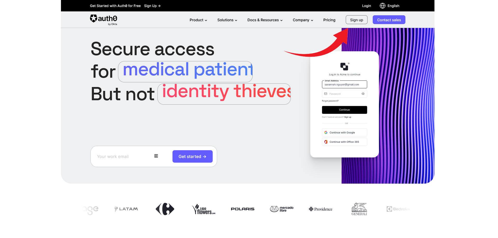
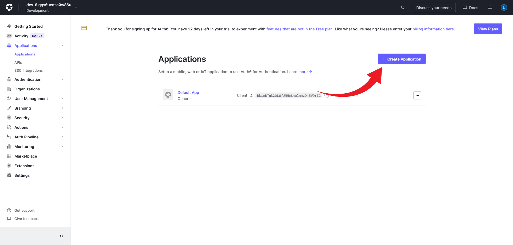
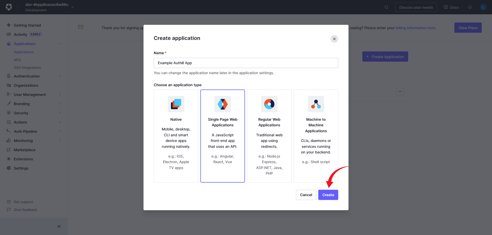
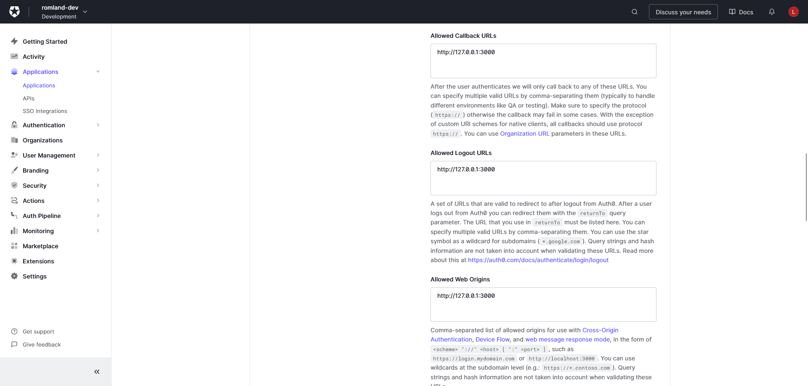
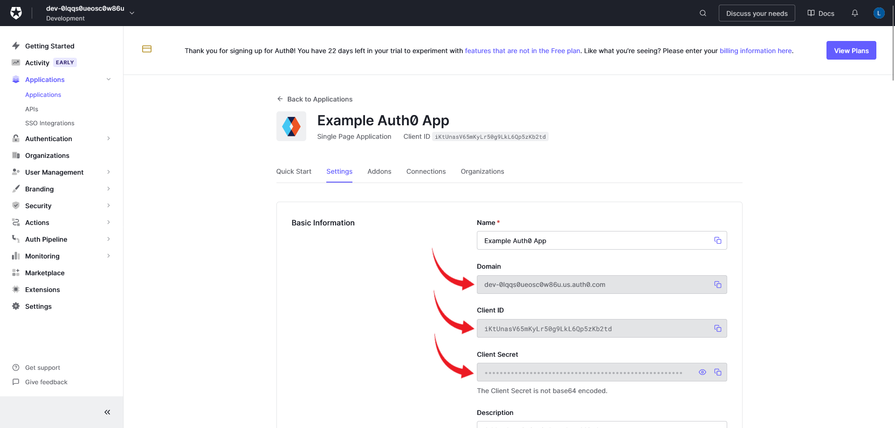
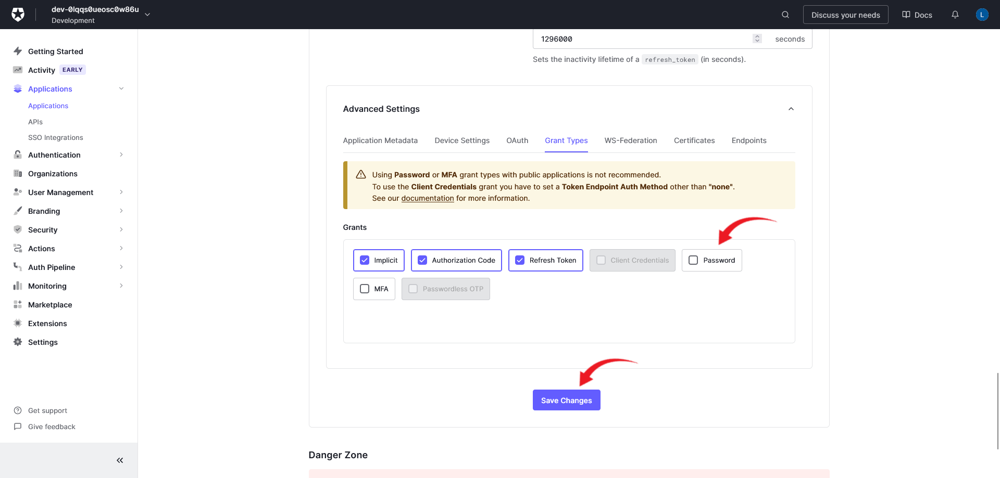
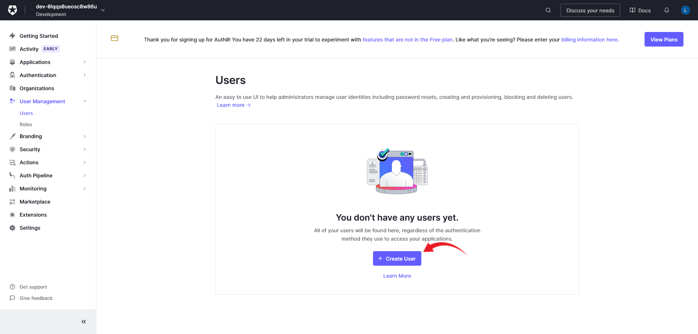
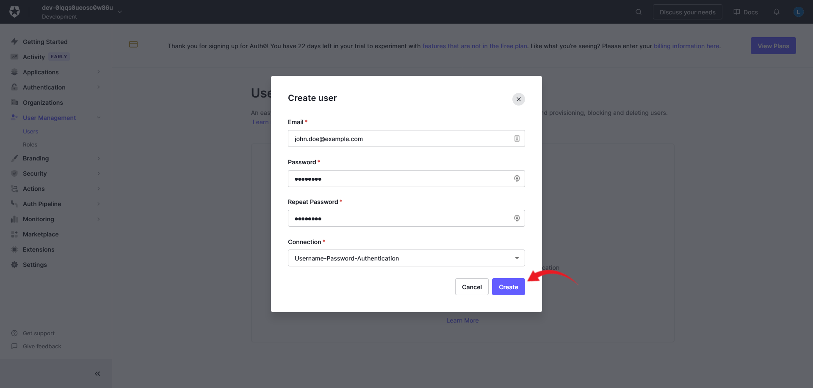
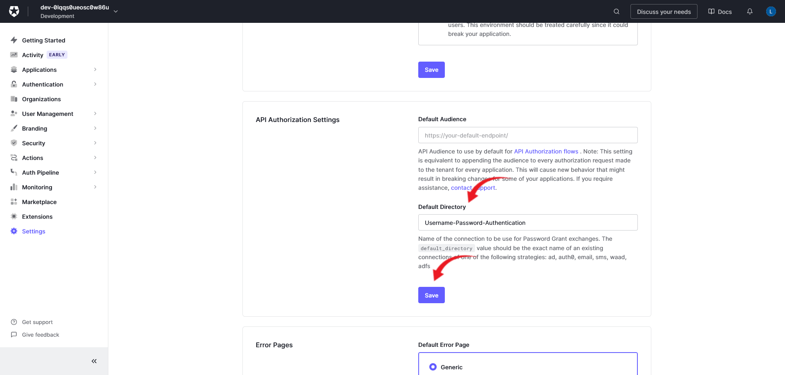

# Auth0

To create an Auth0 application you need to follow the steps below:

1. Go to [Auth0](https://auth0.com/) and create an account if you don't already have one.

show/hide image

 
2. Go to the Applications page and click on the "Create Application" button.

show/hide image

 

3. Choose a name & select "Single Page Web Applications" and click on the "Create" button.

show/hide image

 

4. Go to the "Settings" tab and add the url it will be running on (default is `http://127.0.0.1:3000`) to the "Allowed Callback URLs", "Allowed Logout URLs" and "Allowed Web Origins" fields. Then scroll down and click Save Changes.

Make sure to use `http://127.0.0.1:3000`. The tests will fail if using `http://localhost:3000`.

show/hide image

 

5. Copy the "Domain", "Client ID" and "Client Secret" and past them in the .env file. (See [Environment Variables](../environmentVariables.md) for more information)

show/hide image

 

### This is all you need to do to setup Auth0 for the project if you are not going to run the tests.

 

If you want to run the tests you need to do the following:

1. Scroll down to "Advanced Settings" on the "Settings" tab and click on the "Grant Types" tab. Enable the "Password" grant type and click on the "Save Changes" button.

show/hide image

 

2. Go to the "User Management" tab and click on the "Users" tab in the sidebar. Click on the "Create User" button.

show/hide image

 

3. Fill in the fields and click on the "Create" button.

show/hide image

 

4. Copy the "Email" and "Password" and paste them in the .env file under AUTH0_TEST_USERNAME and AUTH0_TEST_PASSWORD. (See [Environment Variables](../environmentVariables.md) for more information)

5. Click on the "Settings" tab in the sidebar and scroll down to "API Authorization Settings". In the "Default Directory" field select "Username-Password-Authentication" and click on the "Save" button.

show/hide image

 

6. To make the account work, you need to manually login with the account one time before using it in tests. To do this, navigate as normal to the page (http://127.0.0.1:3000/). Then choose to login with username and password instead of google. Accept access to the profile for the test account. Once you are logged in, the account is fully set up and you can now run all of the test.

This is all you need to do to setup Auth0 for the project. You should now be able to run the project and the tests.
