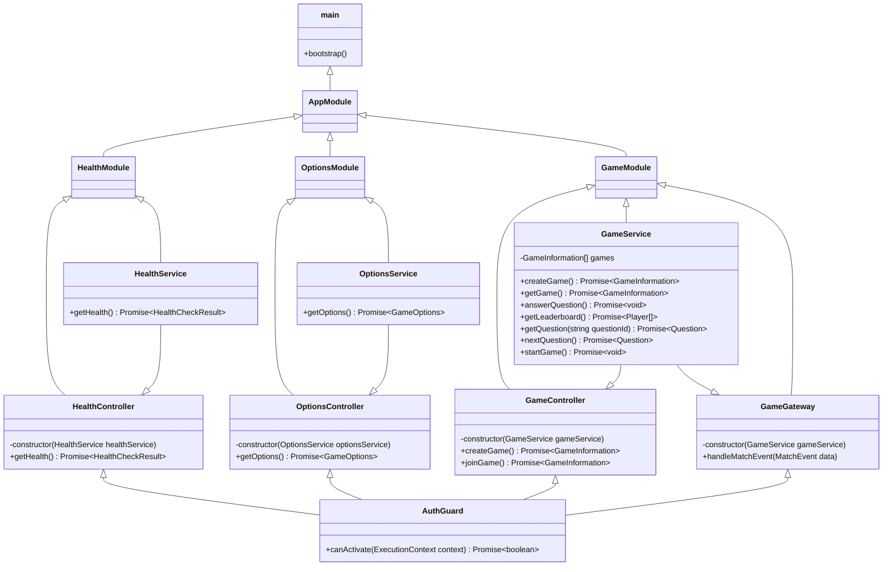

# UML Class Diagram API

```mermaid
classDiagram
    %% Startup function
    class main{
      +bootstrap()
    }

    %% Main Module
    class AppModule

    %% Guards
    class AuthGuard{
      +canActivate(ExecutionContext context) Promise~boolean~
    }

    class HealthModule
    class HealthController{
        -constructor(HealthService healthService)
        +getHealth() Promise~HealthCheckResult~
    }
    class HealthService{
        +getHealth() Promise~HealthCheckResult~
    }

    class OptionsModule
    class OptionsController{
        -constructor(OptionsService optionsService)
        +getOptions() Promise~GameOptions~
    }
    class OptionsService{
        +getOptions() Promise~GameOptions~
    }

    class GameModule
    class GameController{
        -constructor(GameService gameService)
        +createGame() Promise~GameInformation~
        +joinGame() Promise~GameInformation~
    }
    class GameGateway{
        -constructor(GameService gameService)
        +handleMatchEvent(MatchEvent data)
    }
    class GameService{
        -GameInformation[] games
        +createGame() Promise~GameInformation~
        +getGame() Promise~GameInformation~
        +answerQuestion() Promise~void~
        +getLeaderboard() Promise~Player[]~
        +getQuestion(string questionId) Promise~Question~
        +nextQuestion() Promise~Question~
        +startGame() Promise~void~

    }

    %% Relations
    main <|-- AppModule
    AppModule <|-- HealthModule
    AppModule <|-- OptionsModule
    AppModule <|-- GameModule

    HealthModule <|-- HealthController
    HealthModule <|-- HealthService

    HealthController <|-- AuthGuard
    HealthService --|> HealthController

    OptionsModule <|-- OptionsController
    OptionsModule <|-- OptionsService

    OptionsController <|-- AuthGuard
    OptionsService --|> OptionsController

    GameModule <|-- GameController
    GameModule <|-- GameService

    GameController <|-- AuthGuard
    GameGateway <|-- AuthGuard
    GameService --|> GameGateway
    GameService --|> GameController
    GameModule <|-- GameGateway
```
