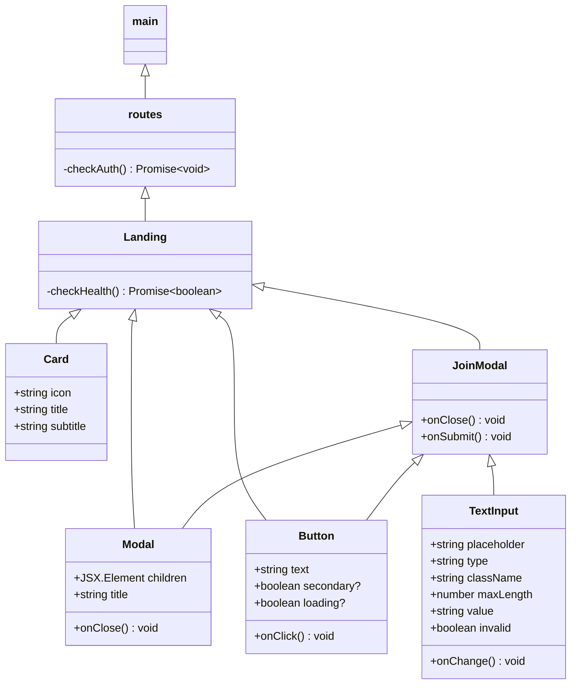

# UML Class Diagram Client

```mermaid
classDiagram
    %% Main file (main.tsx)
    class main{
    }

    %% Routes (routes/index.tsx)
    class routes{
        -checkAuth() Promise~void~
    }

    %% Landing (routes/Landing/Landing.tsx)
    class Landing{
        -checkHealth() Promise~boolean~
    }

    class Button{
        +string text
        +boolean secondary?
        +boolean loading?
        +onClick() void
    }

    class Card{
        +string icon
        +string title
        +string subtitle
    }

    class JoinModal{
        +onClose() void
        +onSubmit() void
    }

    class Modal{
        +JSX.Element children
        +string title
        +onClose() void
    }

    class TextInput{
        +string placeholder
        +string type
        +string className
        +number maxLength
        +string value
        +boolean invalid
        +onChange() void
    }

    %% Relations
    main <|-- routes
    routes <|-- Landing
    Landing <|-- JoinModal
    Landing <|-- Modal
    Landing <|-- Button
    Landing <|-- Card
    JoinModal <|-- Modal
    JoinModal <|-- Button
    JoinModal <|-- TextInput


```
