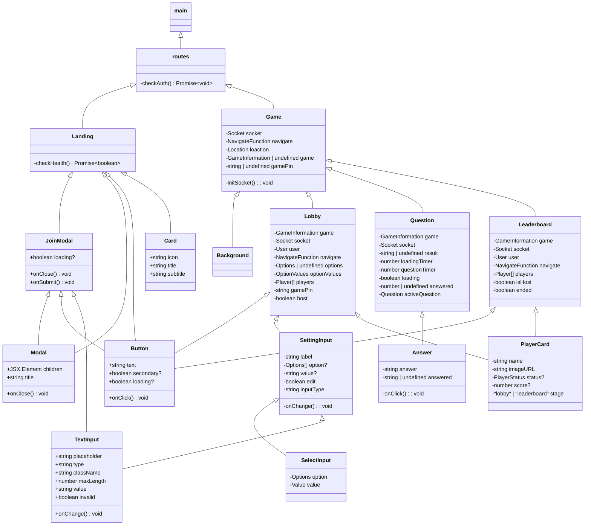

# Component Diagram Client

```mermaid
classDiagram
    %% Main file (main.tsx)
    class main{
    }

    %% Routes (routes/index.tsx)
    class routes{
        -checkAuth() Promise~void~
    }

    %% Landing (routes/Landing/Landing.tsx)
    class Landing{
        -checkHealth() Promise~boolean~
    }

    %% Button (components/Button/Button.tsx)
    class Button{
        +string text
        +boolean secondary?
        +boolean loading?
        +onClick() void
    }

    %% Card (routes/Landing/components/Card/Card.tsx)
    class Card{
        +string icon
        +string title
        +string subtitle
    }

    %% JoinModal (routes/Landing/components/JoinModal/JoinModal.tsx)
    class JoinModal{
        +onClose() void
        +onSubmit() void
        +boolean loading?
    }

    %% Modal (components/Modal/Modal.tsx)
    class Modal{
        +JSX.Element children
        +string title
        +onClose() void
    }

    %% Modal (components/Form/Input/TextInput/TextInput.tsx)
    class TextInput{
        +string placeholder
        +string type
        +string className
        +number maxLength
        +string value
        +boolean invalid
        +onChange() void
    }

    %% Card (routes/Game/Game.tsx)
    class Game{
        -Socket socket
        -NavigateFunction navigate
        -Location loaction
        -GameInformation | undefined game
        -string | undefined gamePin
        -initSocket(): void
    }

    %% Background (components/Background/Background.tsx)
    class Background{

    }

    %% Lobby (routes/Game/Lobby/Lobby.tsx)
    class Lobby{
        -GameInformation game
        -Socket socket
        -User user
        -NavigateFunction navigate
        -Options | undefined options
        -OptionValues optionValues
        -Player[] players
        -string gamePin
        -boolean host
    }

    %% SettingInput (routes/Game/Lobby/components/SettingInput/SettingInput.tsx)
    class SettingInput{
        -string label
        -Options[] option?
        -string value?
        -onChange(): void
        -boolean edit
        -string inputType
    }

    %% SelectInput (components/Form/Input/SelectInput)
    class SelectInput{
        -Options option
        -Value value
    }

    %% PlayerCard (components/PlayerCard/PlayerCard.tsx)
    class PlayerCard{
        -string name
        -string imageURL
        -PlayerStatus status?
        -number score?
        -"lobby" | "leaderboard" stage
    }

    %% Question (routes/Game/Question/Question.tsx)
    class Question{
        -GameInformation game
        -Socket socket
        -string | undefined result
        -number loadingTimer
        -number questionTimer
        -boolean loading
        -number | undefined answered
        -Question activeQuestion
    }

      %% Answer (routes/Game/Question/components/Answer/Answer.tsx
    class Answer{
        -string answer
        -string | undefined answered
        -onClick(): void
    }


    %% Leaderboard (routes/Game/Leaderboard/Leaderboard.tsx)
    class Leaderboard{
        -GameInformation game
        -Socket socket
        -User user
        -NavigateFunction navigate
        -Player[] players
        -boolean isHost
        -boolean ended
    }

    %% Relations
    main <|-- routes
    routes <|-- Landing
    Landing <|-- JoinModal
    Landing <|-- Modal
    Landing <|-- Button
    Landing <|-- Card
    JoinModal <|-- Modal
    JoinModal <|-- Button
    JoinModal <|-- TextInput
    routes <|-- Game
    Game <|-- Background
    Game <|-- Lobby
    Game <|-- Question
    Game <|-- Leaderboard
    Lobby <|-- Button
    Lobby <|-- SettingInput
    SettingInput <|-- SelectInput
    SettingInput <|-- TextInput
    Lobby <|-- PlayerCard
    Question <|-- Answer
    Leaderboard <|-- Button
    Leaderboard <|-- PlayerCard
```
