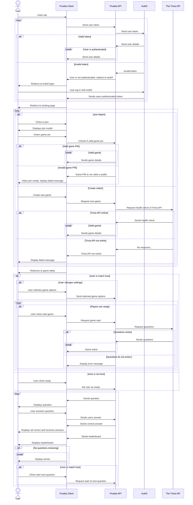

# UML Sequence Diagram

```mermaid
sequenceDiagram
    actor U as User
    participant PC as Prueba Client
    participant PA as Prueba API
    participant A0 as Auth0
    participant TA as The Trivia API

%% Login
U->>PC: Visits site
loop
    PC->>PA: Send user token
    PA->>A0: Send user token
    alt Valid token
        A0->>PA: Send user details
        break User is authenticated
            PA->>PC: Send user details
        end

    else Invalid token
        A0->>PA: Invalid token
        PA->>PC: User is not authenticated, redirect to auth0
        PC->>U: Redirect to Auth0 login
        U->>A0: User log in with Auth0
        A0->>PC: Sends users authentication token
    end
end
PC->>U: Redirect to landing page

loop
    %% Connect to game
    alt Join Match
        U->>PC: Clicks to join
        PC->>U: Displays join modal
        U->>PC: Enters game pin
        PC->>PA: Checks if valid game pin
        alt Valid game PIN
            break Valid game
                PA->>PC: Sends game details
            end
        else Invalid game PIN
            PA->>PC: Game PIN is not valid or public
            PC->>U: Hides join modal, display failed message
        end
    else Create match
        U->>PC: Create new game
        PC->>PA: Request new game
        PA->>TA: Request health check of Trivia API
        alt Trivia API online
            TA->>PA: Sends health check
            break Valid game
                PA->>PC: Sends game details
            end
        else Trivia API not online
            TA->>PA: No response...
            PA->>PC: Trivia API not online
            PC->>U: Display failed message
        end
    end
end

%% Lobby
PC->>U: Redirects to game lobby

alt User is match host
    alt User changes settings
        U->>PC: User selectes game options
        PC->>PA: Send selected game options
    end

    loop
        alt Players are ready
            U->>PC: User clicks start game
            PC->>PA: Request game start
            PA->>TA: Request questions
            alt Questions exists
                TA->>PA: Sends questions
                break
                    PA->>PC: Game starts
                end
            else Questions do not exists:
                PA->>PC: Display error message
            end
        end
    end
else User is not host
    U->>PC: User clicks ready
    PC->>PA: Set user as ready
end

loop
    PA->>PC: Sends question
    PC->>U: Displays question
    U->>PC: User answers question
    PC->>PA: Sends users answer
    PA->>PC: Sends correct answer
    PC->>U: Displays all correct and incorrect answers
    PA->>PC: Sends leaderboard
    PC->>U: Displays leaderboard
    alt No questions remaning
        break
            PC->>U: Display winner
        end
    end

    alt User is match host
        U->>PC: Clicks start next question
        PC->>PA: Request start of next question
    end
end
```